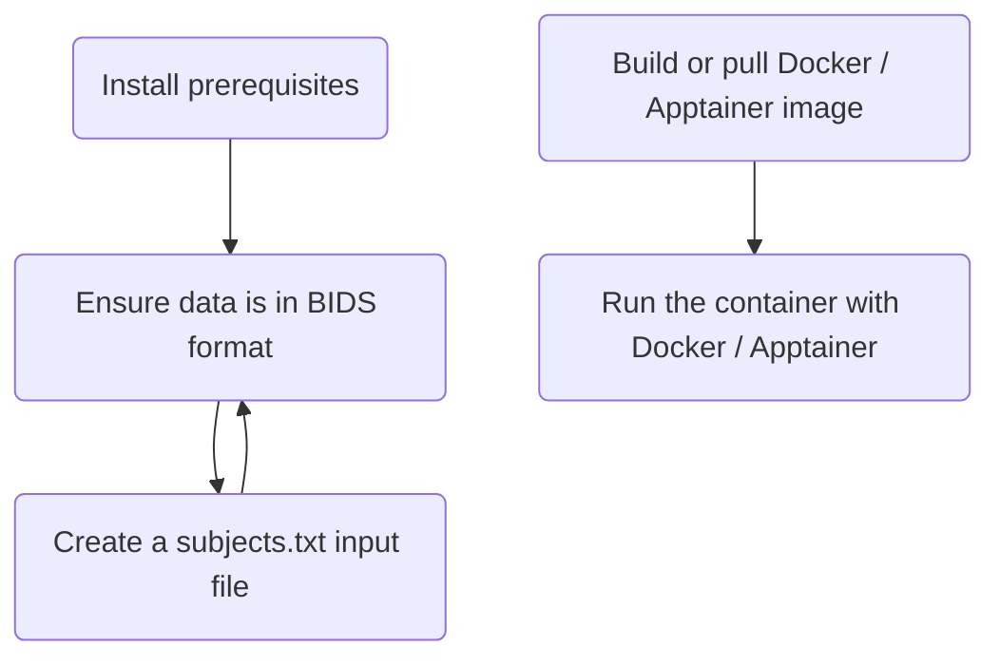

# Enigma-PD-WML

Segment White Matter Lesions (WML) in T1-weighted and FLAIR MRI images using FSL and U-Net

## What does the pipeline do?

This pipeline allows white matter lesions (WMLs) to be segmented from a subject's T1-weighted and FLAIR MRI images from
the same scanning session. The analysis steps (including pre- and post- processing) make use of the following tools:

- [FSL (FMRIB Software Library)](https://fsl.fmrib.ox.ac.uk/fsl/docs/) : a library of analysis tools for FMRI, MRI and
  diffusion brain imaging data.

- [UNet-pgs](https://www.sciencedirect.com/science/article/pii/S1053811921004171?via%3Dihub) : A segmentation pipeline
  for white matter hyperintensities (WMHs) using U-Net.

- [Nipoppy](https://nipoppy.readthedocs.io/en/stable/installation.html) : A Python package
  to structure DICOM and NIFTI images in BIDS format

For details of the processing steps, see the [pipeline documentation](/docs/pipeline.md).

The pipeline is available as a [Docker](https://www.docker.com/) or [Apptainer](https://apptainer.org/) container,
allowing it to be run on many different systems.

## How to run the pipeline?

Setting up and running the pipeline requires the following steps, which are explained in detail in the sections below:



## 1. Install prerequisites

If your MRI data isn't in BIDS format, it is recommended to install [Nipoppy](https://nipoppy.readthedocs.io).

If you want to run the container via Docker, install [Docker Desktop](https://docs.docker.com/get-started/get-docker/).
They have installation instructions for [Mac](https://docs.docker.com/desktop/install/mac-install/),
[Windows](https://docs.docker.com/desktop/install/windows-install/) and
[Linux](https://docs.docker.com/desktop/install/linux-install/) systems.

If you want to use Apptainer instead, then follow the
[installation instructions on their website](https://apptainer.org/docs/user/main/quick_start.html).

## 2. Convert data to BIDS format (if required)

If your data isn't structured in BIDS format, we recommend you use [Nipoppy](https://nipoppy.readthedocs.io)
to restructure your into the required format.

For detailed instructions on the BIDSification process, please see the
[excellent guide](https://github.com/ENIGMA-PD/FS7?tab=readme-ov-file#getting-started) written by the
ENIGMA-PD core team for the FS7 pipeline.

Once you have converted your data to BIDS format, your data directory should have the following
structure:

```bash
data
├───sub-1
│   └───ses-1
│       └───anat
│           ├───sub-1_ses-1_T1w.nii.gz
│           └───sub-1_ses-1_FLAIR.nii.gz
│
├───sub-2
│   └───ses-1
│       └───anat
│           ├───sub-1_ses-1_T1w.nii.gz
│           └───sub-1_ses-1_FLAIR.nii.gz
```

## 3. Create `subjects.txt` file

Inside your top-level BIDS directory (e.g. `data` in the above example structure), create a `subjects.txt` file that
contains subject identifiers (one per line).

The subject identifies **must** match the names of the corresponding subject folders, e.g. `sub-1`, `sub-2`.

Your final file structure should look like below (for two example subject ids):

```bash
data
├── sub-1
│   └── ses-1
│       └── anat
│           ├── sub-1_ses-1_T1w.nii.gz
│           └── sub-1_ses-1_FLAIR.nii.gz
│
├── sub-2
│   └── ses-1
│       └── anat
│           ├── sub-1_ses-1_T1w.nii.gz
│           └── sub-1_ses-1_FLAIR.nii.gz
└── subjects.txt
```

## 4. Build or pull the Docker / Apptainer image

To obtain the image (in Docker or Apptainer), you have the following options:

- Use the image from Docker Hub
- Build the image from source

### Using the image from docker hub

The image is available on docker hub in the
[enigma-pd-wml repository](https://hub.docker.com/r/hamiedaharoon24/enigma-pd-wml/tags).

If you want to run the container via docker, you can download it by running:

```bash
docker pull hamiedaharoon24/enigma-pd-wml:latest
```

If you want to run the container via Apptainer instead, use:

```bash
apptainer build enigma-pd-wml.sif docker://hamiedaharoon24/enigma-pd-wml:latest
```

### Build the image from source

Clone this github repository with:

```bash
git clone https://github.com/UCL-ARC/Enigma-PD-WML.git
```

Build the Docker image with:

```bash
cd Enigma-PD-WML
docker build -f Dockerfile -t enigma-pd-wml .
```

If you want to run the container via Apptainer, you can convert this Docker image into an Apptainer one via:

```bash
docker image save enigma-pd-wml -o enigma-pd-wml.tar
apptainer build enigma-pd-wml.sif docker-archive:enigma-pd-wml.tar
```

## 5. Run the container

Below are various ways to run the container. For each, make sure you run the command the top-level directory
of your BIDS-structured data, e.g. the [`data` directory in this example folder structure](#2-convert-data-to-bids-format-if-required)

Note [there are some options](#options) you can add to the end of the Docker / Apptainer command.

If you encounter issues when running the pipeline, check the [output logs](#output-logs) for any errors.

### Via docker (using image from docker hub)

```bash
docker run "$(pwd)":/data hamiedaharoon24/enigma-pd-wml
```

### Via docker (using image built from source)

```bash
docker run -v "$(pwd)":/data enigma-pd-wml
```

### Via apptainer (using image built from source)

You'll need to put the `.sif` file same directory you run the `apptainer` command from,
or provide the full path to its location.

You should run this command from the directory **above** your top-level BIDS directory, e.g. within `cwd`
if your data is in `cwd/data`.

```bash
apptainer run --bind ${PWD}/<data_dir>:/data enigma-pd-wml.sif
```

replacing `<data_dir>` with the name of your top-level BIDS folder.

### Options

- `-n` : the number of jobs to run in parallel.

  By default (without `-n`), the pipeline will process your subjects sequentially on 1 core. With `-n` they will be
  processed in parallel with `n` jobs. For example:

  ```bash
  # Run with 5 jobs
  -n 5
  ```

  A good default value is the number of cores on your system, but be
  [wary of increased memory usage](#tensorflow-memory-usage).

- `-o` : whether to overwrite existing output files

  By default (without `-o`), the pipeline will try to re-use any existing output files, skipping steps that are already
  complete. This is useful if, for example, the pipeline fails at a late stage and you want to run it again, without
  having to re-run time-consuming earlier steps. With `-o` the pipeline will run all steps again and ensure any previous
  output is overwritten.

## Pipeline output

### Output images

After running your analysis, your BIDS directory should have the following structure:

```bash
bids-data
├── dataset_description.json
├── enigma-pd-wml.log
├── enigma-pd-wml-results.zip
├── sub-1
│   ├── ses-1
│   │   ├── anat
│   │   │   ├── sub-1_ses-1_FLAIR.nii.gz
│   │   │   └── sub-1_ses-1_T1w.nii.gz
│   │   └── derivatives
│   │       └── enigma-pd-wml
│   │           ├── input/
│   │           ├── output/
│   │           ├── sub-1_ses-1.log
│   │           └── sub-1_ses-1_results.zip
│   └── ses-2
│       ├── anat
│       │   ├── sub-1_ses-2_FLAIR.nii.gz
│       │   └── sub-1_ses-2_T1w.nii.gz
│       └── derivatives
│           └── enigma-pd-wml
│               ├── input/
│               ├── output/
│               ├── sub-1_ses-2.log
│               └── sub-1_ses-2_results.zip
```

#### Session-level zip files

The pipeline will generate multiple `.zip` files - one per session, e.g. `sub-1_ses-1_results.zip`.

These zip files should contain six files:

- `results2mni_lin.nii.gz`: WML segmentations linearly transformed to MNI space.

- `results2mni_lin_deep.nii.gz`: WML segmentations (deep white matter) linearly transformed to MNI space.

- `results2min_lin_perivent.nii.gz`: WML segmentations (periventricular) linearly transformed to MNI space.

- `results2mni_nonlin.nii.gz`: WML segmentations non-linearly transformed to MNI space.

- `results2min_nonlin_deep.nii.gz`: WML segmentations (deep white matter) non-linearly transformed to MNI space.

- `results2mni_nonlin_perivent.nii.gz`: WML segmentations (periventricular) non-linearly transformed to MNI space.

#### Top-level zip file

A top-level zip file will also be created (`enigma-pd-wml-results.zip`). This will contain all zip files for each session.

**Please send this top-level zip file to the ENIGMA-PD Vasc team.**

#### Intermediate files

The pipeline generates several intermediate files. These are stored in the `derivatives/enigma-pd-wml/input` and
`derivatives/enigma-pd-wml/output` folders of each session.

### Output logs

Pipeline logs can be found at:

- `enigma-pd-wml.log`: contains minimal information about the initial pipeline setup.

- `enigma-pd-wml/<subject>_<session>.log`: one log per session; stored in the session's `derivatives folder`;
  contains information about the various processing steps.

## Common issues

### Tensorflow memory usage

A common issue is UNets-pgs failing due to high memory usage. You may see warnings / errors in your subject logs
similar to:

- `tensorflow/core/framework/allocator.cc:124] Allocation of 675840000 exceeds 10% of system memory.`

- `/WMHs_segmentation_PGS.sh: line 14: 69443 Killed`

You may want to try:

- Running the pipeline on a system with more memory

- Reducing the number of jobs passed to the `-n` option (if you're using it). This will slow down the pipeline, but
  also reduce overall memory usage.

## For developers

Some brief notes on the development setup for this repository are provided in a
[separate developer docs file](/docs/developer.md).
