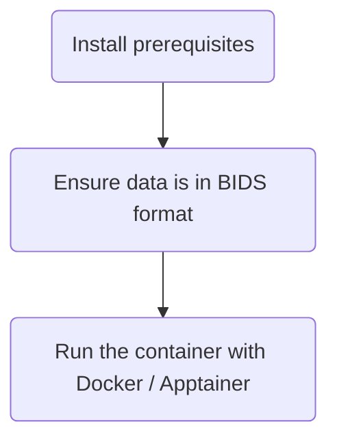

# Enigma-PD-WML

Segment White Matter Lesions (WML) in T1-weighted and FLAIR MRI images using FSL and U-Net

## What does the pipeline do?

This pipeline allows white matter lesions (WMLs) to be segmented from a subject's T1-weighted and FLAIR MRI images from
the same scanning session. The analysis steps (including pre- and post- processing) make use of the following tools:

- [FSL (FMRIB Software Library)](https://fsl.fmrib.ox.ac.uk/fsl/docs/) : a library of analysis tools for FMRI, MRI and
  diffusion brain imaging data.

- [UNet-pgs](https://www.sciencedirect.com/science/article/pii/S1053811921004171?via%3Dihub) : A segmentation pipeline
  for white matter hyperintensities (WMHs) using U-Net.

- [Nipoppy](https://nipoppy.readthedocs.io/en/stable/installation.html) : A Python package
  to structure DICOM and NIFTI images in BIDS format

For details of the processing steps, see the [pipeline documentation](/docs/pipeline.md).

The pipeline is available as a [Docker](https://www.docker.com/) or [Apptainer](https://apptainer.org/) container,
allowing it to be run on many different systems.

## How to run the pipeline?

Setting up and running the pipeline requires the following steps, which are explained in detail in the sections below:



## 1. Install prerequisites

If your MRI data isn't in BIDS format, it is recommended to install [Nipoppy](https://nipoppy.readthedocs.io).

If you want to run the container via Docker, install [Docker Desktop](https://docs.docker.com/get-started/get-docker/).
They have installation instructions for [Mac](https://docs.docker.com/desktop/install/mac-install/),
[Windows](https://docs.docker.com/desktop/install/windows-install/) and
[Linux](https://docs.docker.com/desktop/install/linux-install/) systems.

If you want to use Apptainer instead, then follow the
[installation instructions on their website](https://apptainer.org/docs/user/main/quick_start.html).

## 2. Convert data to BIDS format (if required)

If your data isn't structured in BIDS format, we recommend you use [Nipoppy](https://nipoppy.readthedocs.io)
to restructure your into the required format.

For detailed instructions on the BIDSification process, please see the
[excellent guide](https://github.com/ENIGMA-PD/FS7?tab=readme-ov-file#getting-started) written by the
ENIGMA-PD core team for the FS7 pipeline.

Once you have converted your data to BIDS format, your data directory should have the following
structure:

```bash
data
├───sub-1
│   └───ses-1
│       └───anat
│           ├───sub-1_ses-1_T1w.nii.gz
│           └───sub-1_ses-1_FLAIR.nii.gz
│
├───sub-2
│   └───ses-1
│       └───anat
│           ├───sub-1_ses-1_T1w.nii.gz
│           └───sub-1_ses-1_FLAIR.nii.gz
```

## 3. Run the container

>[!IMPORTANT]
> When running the container, make sure you run the command from the top-level directory
of your BIDS-structured data, e.g. the [`data` directory in this example folder structure](#2-convert-data-to-bids-format-if-required)
<!-- markdownlint-disable MD028/no-blanks-blockquote -->
> [!NOTE]
> There are some [optional arguments](#options) you can add to the end of the Docker / Apptainer command.
<!-- markdownlint-disable MD028/no-blanks-blockquote -->
> [!TIP]
> If you encounter issues when running the pipeline, check the [output logs](#output-logs) for any errors.

### Using Docker

The image is available on Docker Hub in the
[enigma-pd-wml](https://hub.docker.com/r/hamiedaharoon24/enigma-pd-wml/tags) repository.

To run the analysis using Docker:

```bash
docker run -v "${PWD}":/data hamiedaharoon24/enigma-pd-wml:<tag>
```

where `<tag>` is the version of the image you would like to pull.

Note, the image will be downloaded from Docker Hub the first time you run a particular version of the
image.

### Using Apptainer

To run the analysis with Apptainer, you will first need to build an image based on the Docker image
available on Docker Hub.

```bash
apptainer build enigma-pd-wml.sif docker://hamiedaharoon24/enigma-pd-wml:<tag>
```

where `<tag>` is the version of the image you would like to pull.

This will create an `enigma-pd-wml.sif` image in your current working directory.

To run the analysis:

```bash
apptainer run --bind "${PWD}":/data enigma-pd-wml.sif
```

where `<tag>` is the version of the image you would like to pull.

Note, this requires either:

- the `enigma-pd-wml.sif` file is in your current working
  directory (which should be your top-level BIDS data directory)
- or, you provide the full path to the `.sif` file in the command

### Options

- `-n` : the number of jobs to run in parallel. Defaults to 1. See also potentials issues
  of [increased memory usage](#tensorflow-memory-usage) when running in parallel.

- `-o` : overwrite existing intermediate files

  When this flag is set, the pipeline will run all steps of the pipeline, overwriting any previous output for a given
  session.

  When this flag is not set, the pipeline will re-use any existing output files, skipping steps that have previously been
  completed. This is useful if, for example, the pipeline fails at a late stage and you want to run it again, without
  having to re-run time-consuming earlier steps. This is the default behaviour.

- `-f` : Path to a file containing a list of subjects to target.

  The path must be relative to your data directory, and the file must be within the `data/` directory or one of its
  sub-directories. The file must contain one subject per line, e.g.

  ```bash filename="subjects.txt"
  sub-1
  sub-2
  sub-3
  ```

- `-s` : Comma-separated list of subjects to include in the analysis, e.g. `-s sub-1,sub-2,sub-3`

> [!NOTE]
> If both `-f` and `-s` are omitted, the pipeline will be run on all subjects.

## Pipeline output

### Output images

After running your analysis, your data directory should have the following structure:

```bash
data
├── dataset_description.json
├── derivatives
│   └── enigma-pd-wml
│       ├── enigma-pd-wml.log
│       ├── enigma-pd-wml-results.zip
│       └── sub-1
│           ├── ses-1
│           │   ├── input/
│           │   ├── output/
│           │   ├── sub-1_ses-1.log
│           │   └── sub-1_ses-1_results.zip
│           └── ses-2
│               ├── input/
│               ├── output/
│               ├── sub-1_ses-2.log
│               └── sub-1_ses-2_results.zip
├── sub-1
│   ├── ses-1
│   │   └── anat
│   │       ├── sub-1_ses-1_FLAIR.nii.gz
│   │       └── sub-1_ses-1_T1w.nii.gz
│   └── ses-2
│       └── anat
│           ├── sub-1_ses-2_FLAIR.nii.gz
│           └── sub-1_ses-2_T1w.nii.gz
```

#### Session-level zip files

The pipeline will generate multiple `.zip` files - one per session, stored within the corresponding session
sub-folder, e.g. `derivatives/enigma-pd-wml/sub-1/ses-1/sub-1_ses-1_results.zip`.

These zip files should contain six files:

- `results2mni_lin.nii.gz`: WML segmentations linearly transformed to MNI space.

- `results2mni_lin_deep.nii.gz`: WML segmentations (deep white matter) linearly transformed to MNI space.

- `results2min_lin_perivent.nii.gz`: WML segmentations (periventricular) linearly transformed to MNI space.

- `results2mni_nonlin.nii.gz`: WML segmentations non-linearly warped to MNI space.

- `results2min_nonlin_deep.nii.gz`: WML segmentations (deep white matter) non-linearly warped to MNI space.

- `results2mni_nonlin_perivent.nii.gz`: WML segmentations (periventricular) non-linearly warped to MNI space.

- `T1_biascorr_brain_to_MNI_lin.nii.gz`: T1 bias-corrected brain linearly transformed to MNI space.

- `FLAIR_biascorr_brain_to_MNI_lin.nii.gz`: FLAIR bias-corrected brain linearly transformed to MNI space.

- `T1_biascorr_brain_to_MNI_nonlin.nii.gz`: T1 bias-corrected brain non-linearly warped to MNI space.

- `FLAIR_biascorr_brain_to_MNI_nonlin.nii.gz`: FLAIR bias-corrected brain non-linearly warped to MNI space.

#### Top-level zip file

A top-level zip file will also be created (`derivatives/enigma-pd-wml/enigma-pd-wml-results.zip`). This will contain all
zip files for each session.

**Please send this top-level zip file to the ENIGMA-PD Vasc team.**

#### Intermediate files

The pipeline generates several intermediate files. These are stored in the `derivatives/enigma-pd-wml/<subject>/<session>/input`
and `derivatives/enigma-pd-wml/<subject>/<session>/output` folders.

### Output logs

Pipeline logs can be found at:

- `derivatives/enigma-pd-wml/enigma-pd-wml.log`: contains minimal information about the initial pipeline setup.

- `derivatives/enigma-pd-wml/<subject>/<session>/<subject>_<session>.log`: one log per session; contains information about
  the various processing steps.

## Common issues

### Tensorflow memory usage

A common issue is UNets-pgs failing due to high memory usage. You may see warnings / errors in your subject logs
similar to:

- `tensorflow/core/framework/allocator.cc:124] Allocation of 675840000 exceeds 10% of system memory.`

- `/WMHs_segmentation_PGS.sh: line 14: 69443 Killed`

You may want to try:

- Running the pipeline on a system with more memory

- Reducing the number of jobs passed to the `-n` option (if you're using it). This will slow down the pipeline, but
  also reduce overall memory usage.

## For developers

Some brief notes on the development setup for this repository are provided in a
[separate developer docs file](/docs/developer.md).
