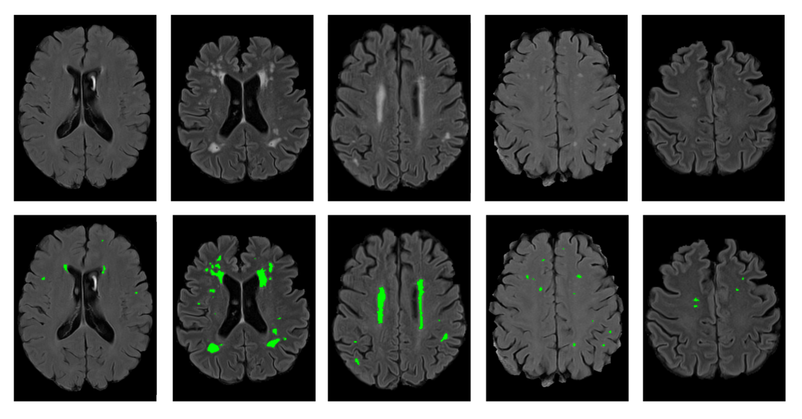

# Quality Control for WML Pipeline

This step is to ensure accurate WML maps have been created.

- Use any MRI viewing platform (e.g., MRIcron, MRIcroGL, ITK-SNAP) to open the original FLAIR image
  (`output` > `FLAIR_orig.nii`) and overlay the WML map (`output` > `results2flairfullfov.nii`).

- Compare the WML map to the WMLs present on the FLAIR scan to assess how well the U-Net segmentation has performed.

- If well segmented, the process has been successful, and the session-level zip files can be sent to the ENIGMA-PD-WML team.
  If poorly segmented the images cannot be included in the analysis. For any unsuccessful scans, please make note of the
  scan number(s) and send to the ENIGMA-PD-WML team.

Examples of well segmented FLAIR images:

  

Examples of poorly segmented FLAIR images: Missed WMLs highlighted with blue arrows.

  

